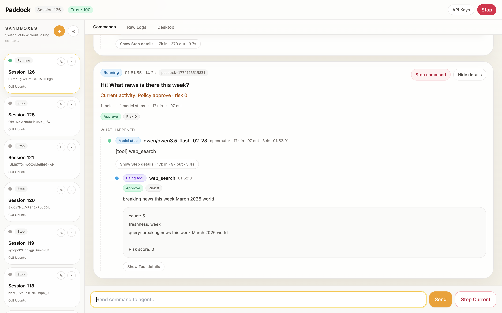

<p align="center">
  <h1 align="center">openPaddock</h1>
  <p align="center">
    <strong>A secure sandbox & monitoring protocol for agents</strong>
  </p>
  <p align="center">
    <a href="./LICENSE"></a>
    <a href="https://nodejs.org"></a>
    <a href="https://www.python.org"></a>
  </p>
  <p align="center">
    <b>English</b> | <a href="./README.zh-CN.md">中文</a>
  </p>
</p>
<div align="center">
  
</div>


Paddock is an open-source sandbox and monitoring protocol for AI agents. Instead of rewriting your agent, Paddock places it inside an isolated Linux MicroVM and layers security, monitoring, audit, and human oversight on top — without breaking the agent's own capabilities.

The repository currently uses [OpenClaw](https://github.com/anthropics/claude-code) as its reference integration target. You can deploy and run OpenClaw inside a Paddock `simple-box` (CLI) or `computer-box` (GUI desktop), while observing every tool call, LLM request, file change, and security verdict through the **AMP protocol**.

## Why Paddock?

Most AI agent frameworks today run with the same privileges as the user. This leads to real problems:

| Problem | What Happens |
|---------|-------------|
| **Prompt injection** | Agent executes dangerous actions after being manipulated |
| **Secret leakage** | Agent reads `.env`, SSH keys, or DB connection strings and exfiltrates them |
| **Scope creep** | Agent escapes workspace boundaries into system directories |
| **Unobservable execution** | No structured record of what the agent did — impossible to debug or audit |
| **Irreversible mistakes** | High-risk operations can't be rolled back |

**Paddock's approach:**

1. Run the agent inside a truly isolated Linux sandbox (MicroVM)
2. Route every critical agent action through a structured protocol (AMP)
3. Add platform-level security layers without rewriting the agent

Paddock is not a fork of OpenClaw. It is not another agent framework. It is:

- A **general-purpose agent sandbox platform**
- A **standardized agent monitoring and boundary protocol**
- A **security runtime for any agent**

<div align="center">
  
</div>

## Core Features

### 🔒 Full Linux Sandbox Isolation
Agents run inside BoxLite-powered MicroVMs — not on the host machine. File system, network, and process isolation are enforced at the hardware level.

### 🧠 Agent Capability Preservation
OpenClaw runs in full-environment mode. File I/O, command execution, browser automation, and all other capabilities remain available inside the sandbox.

### 📡 AMP Monitoring Protocol
The **Agent Monitoring Protocol** provides unified, structured event streams for commands, LLM calls, tool invocations, file changes, security verdicts, approvals, and rollbacks. → [Full AMP Protocol Specification](./docs/AMP_PROTOCOL.md)

### 🛡️ Multi-Layer Security Gate
Every tool call passes through a **4-layer security engine** before execution:

| Layer | Mechanism |
|-------|-----------|
| **1. Rule Engine** | Pattern matching, command injection detection, path traversal prevention |
| **2. Taint Tracking** | Data flow tracking with labels: `Secret`, `PII`, `ExternalContent`, `FileContent` |
| **3. Behavior Analysis** | Sequence pattern detection, loop/circuit breaker, anomaly scoring |
| **4. Trust Decay** | Session-level trust score (0–100), penalty boost on violations |

Risk scores map to verdict tiers:

| Risk Score | Verdict | Action |
|------------|---------|--------|
| 0–30 | `approve` | Execute immediately |
| 31–70 | `approve` | Execute with alert |
| 71–90 | `ask` | HITL approval required |
| 91–100 | `reject` | Block execution |

### 🧑‍⚖️ Human-in-the-Loop (HITL)
High-risk operations trigger an approval dialog in the Dashboard. Users can approve, reject, or modify tool arguments before execution proceeds.

### 🔑 Zero-Trust Credential Isolation
API keys **never enter the sandbox**. The agent uses a dummy key; the Sidecar LLM Proxy intercepts requests, and the Control Plane injects the real key on the host side before forwarding to the LLM provider.

### 🔗 Clear Host Boundary
External APIs, TTS, channels, webhooks, and other host-side capabilities are explicitly routed through Control Plane and MCP boundaries — never silently leaked.

### 📊 Real-Time Dashboard
Create and manage sandboxes, deploy agents, send commands, view semantic execution trees, inspect raw event logs, configure LLM providers, and manage approvals — all from a web UI.

### 📋 Tamper-Proof Audit Trail
Every event is stored in SQLite with a SHA-256 hash chain. Each event's hash is computed from `SHA256(prev_hash + id + seq + type + payload)`, creating an immutable audit trail where tampering breaks the chain.

### 🎛️ Optional LLM Behavior Review
An optional LLM-powered behavior reviewer can be enabled to provide semantic risk scoring alongside the deterministic security engine. Supports Ollama (local) and OpenAI-compatible APIs.

## Architecture

```
┌─────────────────────────────────────────────────────────────┐
│                        Host Machine                         │
│                                                             │
│  ┌──────────┐    ┌──────────────────────────────────────┐   │
│  │Dashboard │◄──►│          Control Plane (:3100)       │   │
│  │  (:3200) │    │  ┌────────────┐  ┌───────────────┐   │   │
│  │          │    │  │  Session   │  │  Event Store  │   │   │
│  │ • Create │    │  │  Manager   │  │  (SQLite +    │   │   │
│  │ • Deploy │    │  ├────────────┤  │   hash chain) │   │   │
│  │ • Monitor│    │  │ LLM Relay  │  ├───────────────┤   │   │
│  │ • HITL   │    │  │ (key inject│  │ HITL Arbiter  │   │   │
│  │ • Audit  │    │  │  + proxy)  │  ├───────────────┤   │   │
│  └──────────┘    │  ├────────────┤  │ Snapshot Mgr  │   │   │
│                  │  │ Sandbox    │  └───────────────┘   │   │
│                  │  │ Drivers    │                      │   │
│                  │  └────────────┘                      │   │
│                  └──────────────────────────────────────┘   │
│                           │                                 │
│              ┌────────────▼────────────┐                    │
│              │     MicroVM Sandbox     │                    │
│              │                         │                    │
│              │  ┌───────────────────┐  │                    │
│              │  │ Sidecar           │  │                    │
│              │  │ • LLM Proxy :8800 │  │                    │
│              │  │ • AMP Gate  :8801 │  │                    │
│              │  │ • Policy Engine   │  │                    │
│              │  │ • FS Watcher      │  │                    │
│              │  │ • Event Reporter  │  │                    │
│              │  │ • Sensitive Vault │  │                    │
│              │  └───────────────────┘  │                    │
│              │                         │                    │
│              │  ┌───────────────────┐  │                    │
│              │  │ Agent Runtime     │  │                    │
│              │  │ (OpenClaw)        │  │                    │
│              │  │ + AMP Plugin      │  │                    │
│              │  └───────────────────┘  │                    │
│              │                         │                    │
│              └─────────────────────────┘                    │
└─────────────────────────────────────────────────────────────┘
```

### Packages

| Package | Description |
|---------|-------------|
| `packages/control-plane` | Host-side control plane: session management, event store, LLM relay, resource boundaries, snapshot management, Dashboard API |
| `packages/sidecar` | Runs inside the VM: LLM proxy, AMP Gate, security engine, file watcher, event reporting |
| `packages/dashboard` | Web UI for sandbox management, agent deployment, monitoring, and HITL approvals |
| `packages/amp-openclaw` | OpenClaw AMP adapter and runtime components (Python) |
| `packages/types` | Shared TypeScript type definitions for AMP events, security, sessions, and sandboxes |
| `thirdparty/openclaw` | Recommended location for pinned upstream OpenClaw source |

## AMP Protocol

The **Agent Monitoring Protocol (AMP)** is the core innovation of Paddock. It defines the structured boundary between an agent and its sandbox platform.

AMP is not an agent framework and not a model protocol. It specifies:

- How tool calls are monitored and gated
- How behavior is reviewed and scored
- How events are reported and audited
- How external capabilities are explicitly surfaced
- How snapshots and rollbacks correlate with commands

### Four Boundary Types

| Boundary | Examples | Principle |
|----------|----------|-----------|
| `sandbox-local` | `read`, `write`, `edit`, `exec`, `browser` | Completed inside the guest VM; gated by AMP Gate |
| `control-plane-routed` | `sessions_*`, `subagents`, `cron`, `rollback` | Appears local to the agent but truth is maintained by the Control Plane |
| `mcp-external` | External APIs, TTS, channels, webhooks | Must cross boundary explicitly; host credentials never leak |
| `disabled` | `gateway` (self-admin) | Blocked inside sandboxes |

### Event Flow

```
Agent → Sidecar → Control Plane → Event Store → Dashboard
         ↓
    Policy Gate
         ↓
    Approve / Ask / Reject
```

→ **[Full AMP Protocol Specification →](./docs/AMP_PROTOCOL.md)**

## Supported Sandbox Types

### `simple-box`
- CLI Ubuntu 22.04
- Ideal for command execution, file operations, compilation, CLI agent tasks
- Powered by BoxLite MicroVMs

### `computer-box`
- GUI-enabled Ubuntu with XFCE desktop
- Ideal for browser automation, desktop UI tasks
- Accessible via noVNC (HTTP :6080 / HTTPS :6443)

### `macos` (Coming Soon)
- macOS sandbox support — planned

## Getting Started

### Prerequisites

| Requirement | Version |
|------------|---------|
| **OS** | macOS Apple Silicon (recommended) or Linux |
| **Node.js** | 22+ |
| **pnpm** | 9+ |
| **Python** | 3.10+ |
| **Docker** | Latest (for rootfs preparation) |

> Docker is used to pull base images and prepare OCI rootfs. After preparation, daily operation does not require Docker to be running.

### Step 1: Clone the Repository

```bash
git clone https://github.com/loopzy/openPaddock.git
cd openPaddock
```

### Step 2: Install JavaScript / TypeScript Dependencies

```bash
pnpm install
```

### Step 3: Prepare OpenClaw Upstream Source

Clone a pinned version of the OpenClaw source:

```bash
mkdir -p thirdparty
git clone https://github.com/openclaw/openclaw thirdparty/openclaw
git -C thirdparty/openclaw checkout 1b31ede435bb5f07d87a5570d07e5d0d2dd5cccf
```

Alternatively, set a custom path:

```bash
export OPENCLAW_SRC=/path/to/your/openclaw
```

Lookup priority: `OPENCLAW_SRC` → `thirdparty/openclaw`

### Step 4: Pull Base Images

```bash
# For simple-box (CLI)
docker pull ubuntu:22.04

# For computer-box (GUI desktop)
docker pull lscr.io/linuxserver/webtop:ubuntu-xfce
```

Pull only what you need — both are optional.

### Step 5: Prepare Local OCI Rootfs

Pre-bake local rootfs to avoid on-the-fly image pulls at first launch:

```bash
# Both sandbox types
pnpm run prepare:sandbox-rootfs

# Or individually:
pnpm run prepare:simplebox-rootfs
pnpm run prepare:computerbox-rootfs
```

If you use a host-local proxy such as Clash, Surge, or v2ray on `127.0.0.1` / `localhost`, you can keep your usual shell exports. `prepare:sandbox-rootfs` automatically rewrites loopback proxy build args to `host.docker.internal` for Docker build steps and adds a host-gateway mapping so the build container can reach the host proxy.

Example:

```bash
export https_proxy=http://127.0.0.1:7890
export http_proxy=http://127.0.0.1:7890
export all_proxy=socks5://127.0.0.1:7890
pnpm run prepare:sandbox-rootfs
```

If you are using an older Docker engine that does not support `host-gateway`, export the proxy directly as `http://host.docker.internal:7890` before running the prepare step.

### Step 6: Prepare Node Runtime

The Node runtime is required because OpenClaw runs inside the VM.

```bash
# Node.js runtime for inside the VM
pnpm run prepare:node-runtime
```

### Step 7: Optional - Build the OpenClaw Runtime Bundle

This step is an optimization for faster startup and more predictable release packaging. It is not required if your priority is maximum compatibility or source-level debugging inside the VM.

If you skip this step, Paddock can still deploy OpenClaw by copying the pinned source tree into the VM and performing the official install/build there.

```bash
# OpenClaw runtime bundle (optional, for faster startup)
pnpm run build:openclaw-runtime
```

### Step 8: Build Control Plane, Dashboard & Sidecar

```bash
pnpm build
./scripts/build-sidecar.sh
```

### Step 9: Configure LLM Provider

#### Option A: Environment Variables

```bash
# OpenRouter (recommended for getting started)
export OPENROUTER_API_KEY="your-openrouter-api-key"

# Or use other providers:
export ANTHROPIC_API_KEY="your-anthropic-api-key"
export OPENAI_API_KEY="your-openai-api-key"
export GOOGLE_API_KEY="your-google-api-key"
```

#### Option B: Dashboard Configuration

After launch, click **"API Keys"** in the Dashboard header to configure providers interactively.

### Step 10: Start the Control Plane

```bash
pnpm run dev:control
```

Default address: `http://localhost:3100`

### Step 11: Start the Dashboard

Open a new terminal:

```bash
pnpm run dev:dashboard
```

Default address: `http://localhost:3200`

### Step 12: Create a Sandbox

1. Open the Dashboard at `http://localhost:3200`
2. Click **"+"** to create a new sandbox
3. Select sandbox type:
   - **Simple Box** — CLI Ubuntu 22.04
   - **Computer Box** — GUI Ubuntu XFCE Desktop
4. Wait for status to change from `Starting` → `Running`

### Step 13: Deploy OpenClaw

1. In the session panel, click **"Deploy Agent"**
2. Select **OpenClaw (auto-install with bundle/source fallback)**
3. Wait for the agent to report ready

Paddock chooses the deployment path in this order:

1. **Official runtime bundle** — fastest and best for release builds
2. **VM source install** — copies the pinned OpenClaw source tree from `OPENCLAW_SRC` or `thirdparty/openclaw`, then installs and builds it inside the VM

> If you built the runtime bundle in Step 7, Paddock uses it first for faster startup. If not, or if you prefer maximum compatibility, Paddock can install OpenClaw from the pinned source tree inside the VM. On first deployment, the install script will also set up Chromium inside the VM via `apt` if a browser is not yet available. The VM source path installs `pnpm` and OpenClaw dependencies inside the VM, so it is slower and may require network access from the sandbox.

### Step 14: Start Using OpenClaw in the Sandbox

Once deployed, send commands to OpenClaw through the Dashboard:

- *"Create a hello world C program and run it"*
- *"Open a webpage in the browser and summarize its content"*
- *"Set up a simple Python HTTP server in the workspace"*

### Step 15: Observe Execution

The Dashboard provides two views:

| View | Description |
|------|-------------|
| **Commands** | Semantic execution tree — user commands, LLM turns, tool intents, verdicts, results, final replies |
| **Raw Logs** | Full event stream for debugging and forensic audit |

## Optional: Enable LLM Behavior Review

The default security pipeline is fully deterministic (Rule Engine → Taint Tracker → Behavior Analyzer). You can optionally enable an **LLM-powered behavior reviewer** for semantic risk scoring:

### Using Ollama (Local)

```bash
export PADDOCK_BEHAVIOR_LLM_ENABLED=1
export PADDOCK_BEHAVIOR_LLM_PROVIDER=ollama
export PADDOCK_BEHAVIOR_LLM_MODEL=qwen3:0.6b
export PADDOCK_BEHAVIOR_LLM_BASE_URL=http://127.0.0.1:11434
```

### Using OpenAI-Compatible API

```bash
export PADDOCK_BEHAVIOR_LLM_ENABLED=1
export PADDOCK_BEHAVIOR_LLM_PROVIDER=openai-compatible
export PADDOCK_BEHAVIOR_LLM_MODEL=gpt-4.1-mini
export PADDOCK_BEHAVIOR_LLM_BASE_URL=https://your-endpoint/v1
export PADDOCK_BEHAVIOR_LLM_API_KEY=your-key
```

## Supported LLM Providers

| Provider | Env Variable | API Base URL |
|----------|-------------|-------------|
| Anthropic | `ANTHROPIC_API_KEY` | `https://api.anthropic.com` |
| OpenAI | `OPENAI_API_KEY` | `https://api.openai.com` |
| OpenRouter | `OPENROUTER_API_KEY` | `https://openrouter.ai` |
| Google | `GOOGLE_API_KEY` | `https://generativelanguage.googleapis.com` |

## Roadmap

- ✅ Control Plane, Sidecar, Dashboard core pipeline
- ✅ `simple-box` / `computer-box` dual sandbox support
- ✅ Full OpenClaw operation inside sandbox
- ✅ End-to-end event stream: LLM, tools, file changes, security verdicts
- ✅ 4-layer security engine: rules, taint tracking, behavior analysis, trust decay
- ✅ Optional LLM behavior review layer
- ✅ Dashboard semantic execution tree + raw log views
- ✅ Sensitive Data Vault (auto-mask secrets in LLM traffic)
- 🔜 Intent injection semantic review module
- 🔜 Snapshot & rollback
- 🔜 Enhanced approval & policy system
- 🔜 Multi-agent orchestration support
- 🔜 Plugin marketplace for custom security rules
- 🔜 macOS sandbox support

`openPaddock` is currently in early active development. We are releasing this early to validate the AMP (Agent Management Protocol) architecture and gather community feedback. PRs are highly welcome!

## License

This project is licensed under the [Apache License 2.0](./LICENSE).

## Acknowledgments

- [OpenClaw / Claude Code](https://github.com/anthropics/claude-code) — Reference agent integration
- [BoxLite](https://docs.boxlite.ai/) — MicroVM runtime engine
